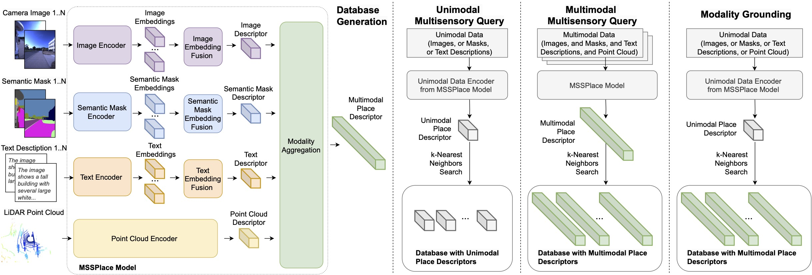

# MSSPlace: Multi-Sensor Place Recognition with Visual and Text Semantics

This repository contains the code for the paper "MSSPlace: Multi-Sensor Place Recognition with Visual and Text Semantics".



_High-level overview of the proposed multimodal MSSPlace method. The MSSPlace Model has a modular architecture and consists of four branches: the Image Encoder, Semantic Masks Encoder, Text Encoder, and Point Cloud Encoder. Each branch encodes the input data into a descriptor, capturing the essential information specific to its respective modality. Subsequently, a descriptor aggregation step is performed to combine these individual descriptors and obtain the global place descriptor, which represents the comprehensive characteristics of the vehicle place._

## Installation

Initialize submodules and build the Docker environment:

```bash
git submodule update --init --recursive
bash docker/build.sh
bash docker/start.sh [DATASETS_DIR]  # DATASETS_DIR will be mounted at /home/docker_mssplace/Datasets
bash docker/into.sh
```

## Quick Start

Evaluate pre-trained models on Oxford RobotCar or NCLT datasets:

```bash
# Download checkpoints and datasets first (see sections below)
python evaluate_checkpoints.py --dataset oxford --model mssplace-li
python evaluate_checkpoints.py --dataset nclt --model mssplace-list --verbose
```

## Evaluation

### Performance Metrics

- **AR@1**: Accuracy (%) when considering top-1 retrieval match
- **AR@1%**: Accuracy (%) when considering top-1% of database as potential matches

### Model Variants

| Model | Modalities | AR@1 (Oxford) | AR@1% (Oxford) | AR@1 (NCLT) | AR@1% (NCLT) | Description |
|-------|------------|---------------|----------------|-------------|--------------|-------------|
| `mssplace-li` | LiDAR + Images | 98.21% | 99.53% | 94.67% | 97.72% | Basic multimodal |
| `mssplace-lis` | LiDAR + Images + Semantic | **98.55%** | **99.64%** | **95.37%** | **97.84%** | Adds semantic segmentation |
| `mssplace-lit` | LiDAR + Images + Text | 98.22% | 99.53% | 92.36% | 96.51% | Adds text descriptions |
| `mssplace-list` | LiDAR + Images + Semantic + Text | **98.55%** | **99.64%** | 94.15% | 96.97% | Complete multimodal |

*Performance metrics measured on Oxford RobotCar and NCLT datasets. Best results per dataset highlighted in bold.*

**Key Insights:**
- `mssplace-lis` achieves the best performance on NCLT, while both `mssplace-lis` and `mssplace-list` tie for best on Oxford
- Semantic segmentation consistently helps place recognition across both datasets
- Text modality shows dataset-dependent behavior: hurts performance on NCLT but is neutral on Oxford
- Oxford dataset appears easier than NCLT (all models achieve >98% vs 92-95% AR@1)
- The complete multimodal `mssplace-list` performs well but doesn't consistently exceed semantic-only variants

### Pre-trained Checkpoints

⚠️ **Work in Progress**: Checkpoint download links will be updated soon. Please check back later for access to pre-trained models.

### Datasets

⚠️ **Work in Progress**: Preprocessed datasets will be made publicly available for download soon. Please check back later for dataset access.

### Directory Structure

```
/home/docker_mssplace/
├── MSSPlace/                    # This repository
│   ├── evaluate_checkpoints.py
│   └── checkpoints/             # Downloaded checkpoints
└── Datasets/                    # Dataset directory (configurable with --datasets-dir)
    ├── pnvlad_oxford_robotcar/
    └── NCLT_preprocessed/
```

### Key Arguments

| Argument | Default | Description |
|----------|---------|-------------|
| `--dataset` | *Required* | `oxford` or `nclt` |
| `--model` | *Required* | Model variant (see table above) |
| `--datasets-dir` | `/home/docker_mssplace/Datasets` | Path to datasets |
| `--batch-size` | `32` | Batch size |
| `--verbose` | `False` | Detailed logging |

## Training (Optional)

⚠️ **Work in Progress**: Training documentation and scripts will be updated soon. Please check back later for training instructions.

## Troubleshooting

- **Missing checkpoints**: Download all `.pth` files to `checkpoints/`
- **Dataset errors**: Verify directory structure matches expected format
- **CUDA memory**: Reduce `--batch-size` if out-of-memory
- **Dependencies**: Use provided Docker environment
